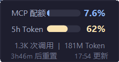
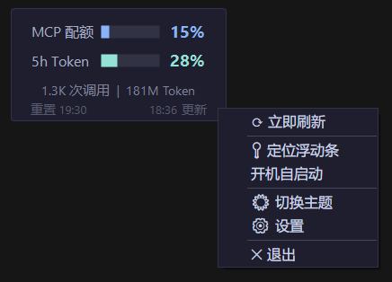
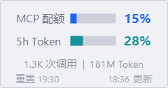
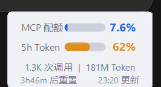
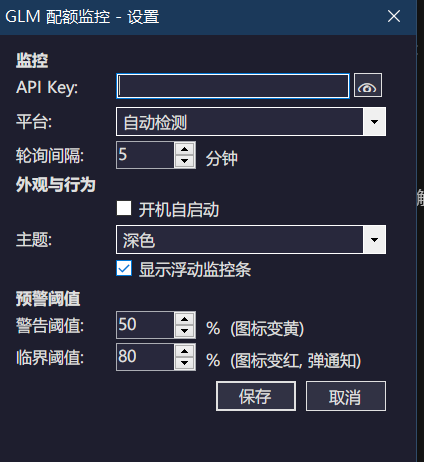

# 智谱配额监控 / GLM Quota Monitor

Windows 桌面常驻工具，实时监控智谱 AI (GLM) / Z.ai 的 API 使用配额。

## 截图

### 深色模式

| 浮动卡片 | 贴边吸附 | 右键菜单 |
|:--------:|:--------:|:--------:|
|  |  |  |

### 浅色模式

| 浮动卡片 | 贴边吸附 |
|:--------:|:--------:|
|  |  |

### 设置



## 功能

- **浮动卡片** — 置顶显示 MCP 配额和 5h Token 流控，实时刷新
- **贴边吸附** — 拖到屏幕边缘自动收起为迷你进度条，悬停展开
- **右键菜单** — 刷新、定位、主题切换、设置
- **智能预警** — 配额超限时弹出 Windows 通知
- **深色/浅色主题** — Catppuccin 配色，跟随系统自动切换
- **纯绿色** — 零注册表，删 exe 即卸载

## 快速开始

### 下载

从 [Releases](https://github.com/mydelren/GLMQuotaMonitor/releases) 下载：

| 文件 | 说明 | 体积 |
|------|------|------|
| `GLMQuotaMonitor-light.exe` | 轻量版（框架依赖） | ~200KB |
| `GLMQuotaMonitor-full.exe` | 完整版（自包含） | ~68MB |

**轻量版** 需要已安装 [.NET 8 Desktop Runtime](https://dotnet.microsoft.com/download/dotnet/8.0)。如果不确定，请下载**完整版**。

### 首次运行

1. 双击 exe 运行
2. 首次启动时，程序会尝试读取环境变量 `ANTHROPIC_AUTH_TOKEN`
3. 如未配置，会弹出设置窗口，手动填入 API Key

### 从源码构建

```bash
git clone https://github.com/mydelren/GLMQuotaMonitor.git
cd GLMQuotaMonitor

# 构建
dotnet build -c Release

# 发布轻量版
dotnet publish -c Release -r win-x64 --self-contained false -p:PublishSingleFile=true

# 发布完整版
dotnet publish -c Release -r win-x64 --self-contained true -p:PublishSingleFile=true -p:IncludeNativeLibrariesForSelfExtract=true
```

## 配置

### API Key

程序按以下优先级获取 API Key：

1. 手动配置（设置窗口中填写，存储于 `%AppData%\GLMQuotaMonitor\config.json`）
2. 环境变量 `ANTHROPIC_AUTH_TOKEN`

### 平台

程序自动从环境变量 `ANTHROPIC_BASE_URL` 识别平台：

| 平台 | 域名 |
|------|------|
| 智谱 AI | `open.bigmodel.cn` |
| 智谱 AI (dev) | `dev.bigmodel.cn` |
| Z.ai | `api.z.ai` |

如未设置环境变量，可在设置窗口中手动选择。

### 设置项

| 项目 | 默认值 | 说明 |
|------|--------|------|
| API Key | — | 智谱/Z.ai 的 API Key |
| 平台 | 自动检测 | 智谱 AI / Z.ai |
| 轮询间隔 | 5 分钟 | 数据刷新频率（可配置 1-30 分钟） |
| 主题 | 自动 | 深色/浅色/跟随系统 |
| 警告阈值 | 50% | 图标变黄 |
| 临界阈值 | 80% | 图标变红，弹通知 |

## 错误处理

- **请求超时**：10 秒
- **重试策略**：连续失败 3 次后自动进入退避重试模式（间隔指数递增，最长 30 分钟），恢复后自动回到正常轮询
- **离线显示**：网络不可用时显示最后一次成功获取的数据
- **启动延迟**：首次请求在启动 3 秒后执行

## 卸载

纯绿色软件，不写注册表，不往系统目录写文件。

1. 退出程序（右键托盘图标 → 退出）
2. 删除 exe 即可

> 如果 exe 放在受保护目录（如 `C:\Program Files\`），配置文件会回退到 `%AppData%\GLMQuotaMonitor\`，删除该目录即可。

## 技术栈

- C# / .NET 8 LTS
- Windows Forms
- 目标框架：`net8.0-windows`
- 运行时：`win-x64`
- 配色：[Catppuccin](https://catppuccin.com/) Mocha (深色) / Latte (浅色)

## API 说明

本工具调用智谱/Z.ai 的监控 API：

```
GET https://{domain}/api/monitor/usage/quota/limit
Authorization: {your_api_key}
```

- `TIME_LIMIT` — MCP 月度配额
- `TOKENS_LIMIT` — 5 小时 Token 流控窗口

## 致谢

灵感来源：

- [CowanNath/GLMQuotaWatcher](https://github.com/CowanNath/GLMQuotaWatcher) — VS Code 版配额监控
- [Safphere/glm-usage-vscode](https://github.com/Safphere/glm-usage-vscode) — VS Code 版实时用量监控
- [Catppuccin](https://catppuccin.com/) — 配色方案

## 关键词

智谱 AI、GLM、Z.ai、配额监控、用量监控、API 监控、Coding Plan、MCP 配额、Token 限流、桌面悬浮窗、系统托盘、Windows 小工具、深色模式、Catppuccin

## 许可证

MIT License
